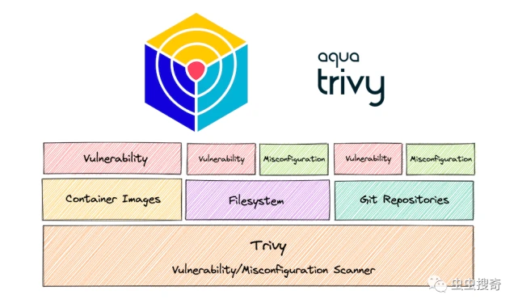
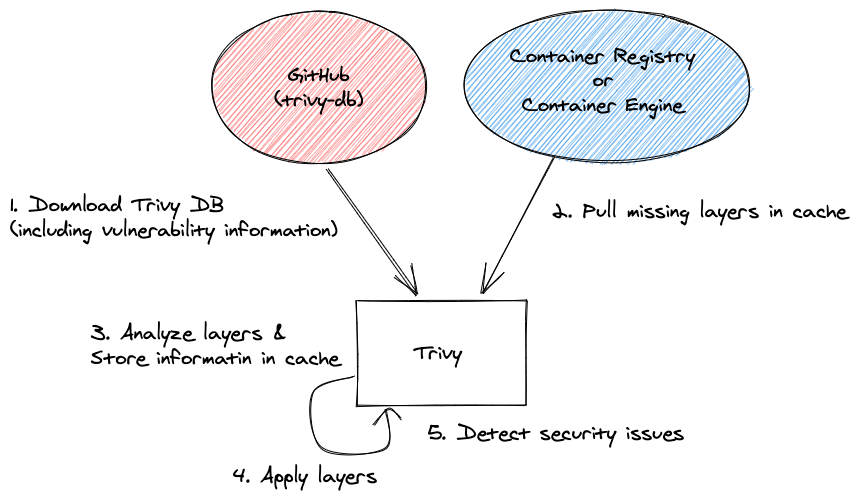
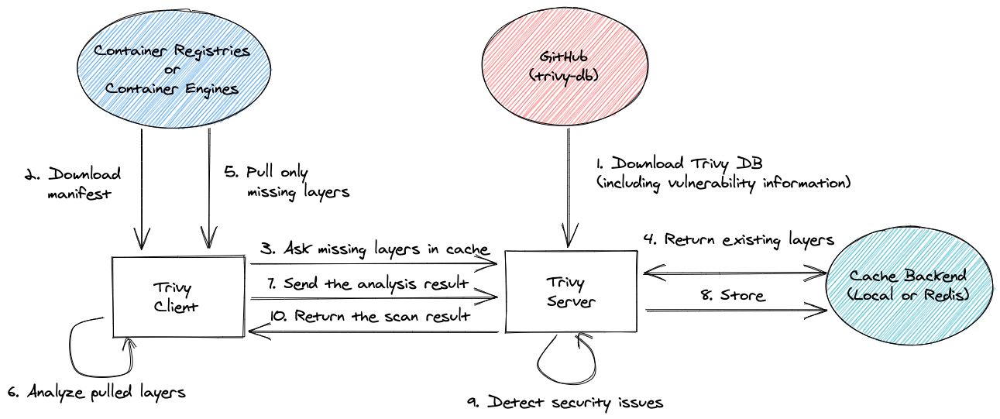

# Container Scanning Process

## Overview
Container image scanning process is used to identify vulnerabilities within containers and their components.

Container scanning is considered as a part of software composition analysis (SCA), and it uses Tools(scanning solutions) that analysis container image layer by layer to detect potential issues. most solution depends on a database set of knowned vulnerabilities so that Orgnization can stay up-to-date as security threat may evolve.

## Using Trivy for Effective Security Analysis

Trivy is an open-source vulnerability scanner specifically designed for containers. It is a lightweight and easy-to-use tool that helps identify vulnerabilities in container images and filesystems. Trivy focuses on scanning container images for known vulnerabilities in the installed packages and libraries.
Some key features of Trivy include:
1.	Comprehensive vulnerability database: Trivy maintains an extensive vulnerability database, which it uses to compare the installed packages and libraries in a container image against known vulnerabilities. It supports various vulnerability databases, including CVE (Common Vulnerabilities and Exposures), Red Hat Security Data, and Ubuntu Security Notices.
2.	Fast and efficient scanning: Trivy is designed to be fast and efficient, providing quick scan results for container images. It leverages a vulnerability detection method called static analysis, which helps expedite the scanning process.
3.	Easy integration: Trivy can be easily integrated into your CI/CD pipeline or used as a standalone tool. It supports scanning local Docker images, remote container registries, and filesystems.
4.	Multiple output formats: Trivy provides scan results in multiple output formats, such as JSON, table, and template, allowing you to choose the format that best suits your needs. This makes it easy to integrate Trivy with other tools or processes.
5.	Continuous updates: Trivy is actively maintained and regularly updated with new vulnerability information. It is designed to stay up to date with the latest security advisories and vulnerability databases, ensuring accurate and relevant scan results.
Trivy is widely used in the container security ecosystem due to its simplicity, speed, and effectiveness in identifying vulnerabilities in container images. It helps organizations improve the security of their containerized applications by enabling them to proactively address vulnerabilities before deploying containers into production environments.
Trivy has scanners that look for security issues, and targets where it can find those issues.
Scanners :
•	OS packages and software dependencies in use (SBOM)
•	Known vulnerabilities (CVEs)
•	IaC issues and misconfigurations
•	Sensitive information and secrets
•	Software licenses
Targets :
•	Container Image
•	Kubernetes services
•	Git Repository
•	Filesystem
•	Virtual Machine Image
•	Kubernetes
•	AWS


### Install Trivy Using container Image
1. pull Trivy image
`docker pull aquasec/trivy`

2. It is advisable to mount a consistent cache dir and docker.sock from the host
`docker run -v /var/run/docker.sock:/var/run/docker.sock -v $HOME/Library/Caches:/root/.cache/ aquasec/trivy:0.48.3 image python:3.4-alpine
`

For other installation, please refer to [Installing Trivy](https://aquasecurity.github.io/trivy/v0.48/getting-started/installation/)

### Scan the Docker Image:

`trivy image myapp:latest`

Trivy will analyze the layers of the Docker image and compare the installed packages and libraries against its vulnerability database. It will then provide a report highlighting any known vulnerabilities found.
The output of the trivy image myapp:latest command would typically provide a report of the vulnerabilities discovered in the Docker image. The report includes information such as vulnerability IDs, severity levels, affected packages, and affected versions. Here's an example of how the output might look:
```
vulnerability ID    | PACKAGE       | INSTALLED VERSION | FIXED VERSION | SEVERITY
CVE-2021-1234       | openssl       | 1.2.3            | 1.2.3-1       | CRITICAL
CVE-2022-5678       | curl          | 7.9.0            | 7.9.1         | HIGH
CVE-2023-9012       | nginx         | 1.18.0           | Not fixed     | MEDIUM

```
In this example, the output shows three vulnerabilities with their respective details. The “vulnerability ID” column displays the unique identifier for each vulnerability, often assigned by the Common Vulnerabilities and Exposures (CVE) system. The “PACKAGE” column indicates the affected package or library. “INSTALLED VERSION” refers to the version currently installed in the Docker image, and “FIXED VERSION” indicates the recommended version that includes the security fix for the vulnerability.
The “SEVERITY” column provides an indication of the severity level assigned to each vulnerability, ranging from CRITICAL to LOW or UNKNOWN. The severity level helps prioritize the remediation efforts.

### Review the scan results:
Trivy will display a report highlighting the vulnerabilities found, including details such as vulnerability IDs, severity levels, affected packages, and affected versions.

### Mitigate the Vulnerabilities:
Depending on the severity and impact of the vulnerabilities, you can consider the following actions:
* Update base image: If the vulnerabilities are related to the base image, check for any updates provided by the image maintainer. Pull the latest version of the base image and rebuild your Docker image with the updated base image.
* Update packages: If specific packages or libraries within the image are affected by vulnerabilities, update those packages to their patched versions. Make the necessary changes to your Dockerfile or build process to ensure the updated packages are included.

### Perform regular scans: 
It is recommended to perform regular scans using Trivy as part of your CI/CD pipeline or periodically as part of your security practices. This helps you identify and mitigate vulnerabilities in your Docker images on an ongoing basis.

## Kubernetes configuration / service:
You can use trivy to detect any misconfiguration in your configuration file. E.g., to detect misconfiguration in the below Pod definition file, pass the conf option to the trivy command.

```
# cat configs/security-context.yaml 
apiVersion: v1
kind: Pod
metadata:
  name: security-context-demo
spec:
  securityContext:
    runAsUser: 0
    runAsGroup: 3000
    fsGroup: 2000
  volumes:
  - name: sec-ctx-vol
    emptyDir: {}
  containers:
  - name: sec-ctx-demo
    image: busybox
    command: [ "sh", "-c", "sleep 1h" ]
    volumeMounts:
    - name: sec-ctx-vol
      mountPath: /data/demo
    securityContext:
      allowPrivilegeEscalation: false
trivy conf ./configs

```

## Trivy in client/server mode
Trivy has client/server mode. Trivy server has vulnerability database and Trivy client doesn't have to download vulnerability database. It is useful if you want to scan images at multiple locations and do not want to download the database at every location.

### Server
At first, you need to launch Trivy server. It downloads vulnerability database automatically and continue to fetch the latest DB in the background.
```
$ trivy server --listen localhost:8080
2019-12-12T15:17:06.551+0200    INFO    Need to update DB
2019-12-12T15:17:56.706+0200    INFO    Reopening DB...
2019-12-12T15:17:56.707+0200    INFO    Listening localhost:8080...
```
If you want to accept a connection from outside, you have to specify 0.0.0.0 or your ip address, not localhost.

`$ trivy server --listen 0.0.0.0:8080`

### Client
Then, specify the remote address.
`$ trivy client --remote http://localhost:8080 alpine:3.10`

### Authentication
`$ trivy server --listen localhost:8080 --token dummy`

`$ trivy client --remote http://localhost:8080 --token dummy alpine:3.10`

## Architecture


## Reference

[Trivy Documentation](https://aquasecurity.github.io/trivy/v0.20.2/advanced/modes/client-server/)
