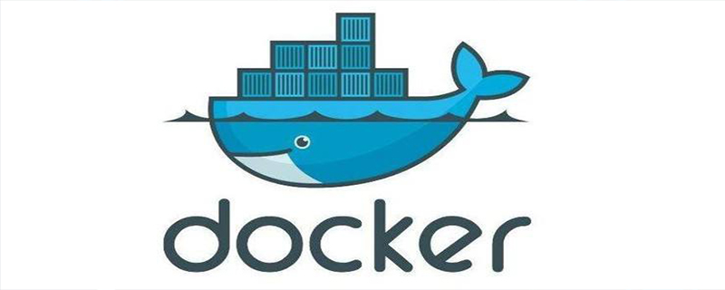

# Image Hardening Process

## Overview 
This document is for introducing the process of container images hardening and store them as artifacts in shard container registries.

Image hardening process utilizes AquaScan as the primary tool for images scanning.

