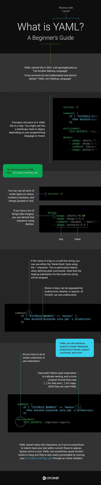

# What is YAML? A beginner's guide

YAML is a digestible data serialization language often used to create configuration files with any programming language.

Designed for human interaction, YAML is a strict superset of JSON, another data serialization language. But because it’s a strict superset, it can do everything that JSON can and more. One major difference is that newlines and indentation actually mean something in YAML, as opposed to JSON, which uses brackets and braces.

The format lends itself to specifying configuration, which is how we use it at CircleCI.

